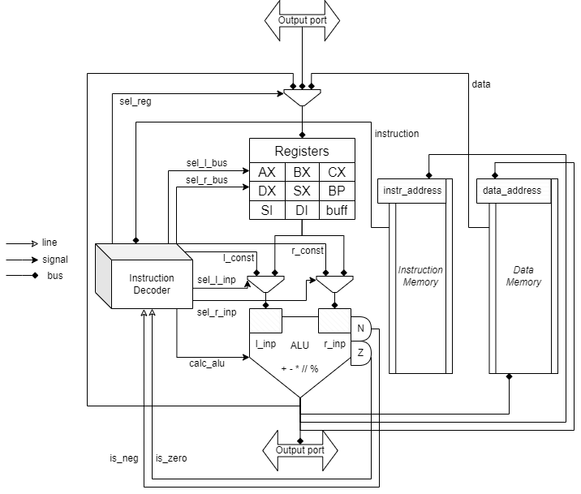

### Миху Вадим Дмитриевич
```
asm | cisc | harv | hw | instr | binary | trap | port | cstr | prob1 | spi
```

## Лабораторная работа №3 по дисциплине "Архитектура Компьютера"

- ЯП. Синтаксис: **asm**
  - Синтаксис ассемблера
  - Необходима поддержка label-ов
- Архитектура: **cisc**
  - Система команд должна содержать сложные инструкции переменной длины и разрешающие адресацию как регистров, так и памяти
- Организация памяти: **harv**
  - Гарвардская архитектура
- Control Unit: **hw** 
  - hardwided
  - Реализуется как часть модели
- Точность модели: **instr**
  - Процессор необходимо моделировать с точности до исполнения инструкции
- Представление машинного кода: **binary**
  - В виде низкоуровневой структуры данных

### Язык программирования
 - Для реализации было создано подобие 16-битного ассемблера intel 8088
 - При этом так как архитектура Гарвардская, для упрощения компиляции,
, режимов адресации, размещения в памяти и т.д. машинное слово инструкций
размером в 32 бита, адресное пространство памяти размером 8 бит
 - Были назначенные собственные части слов для обозначения операции,
адресации

### Синтаксис
```
; секция кода
code:
    [label:] 
    instr [op1, [op2]]

; секция данных
data
    var: (STR) | (NUM)
```
```
code:
print_char:               ; метка
MOV ax [label]            ; загрузить
                          ; в регистр ax
                          ; значение label
                          ; (косвенная адресация) 

CMP ax, bx                ; сравнить
                          ; регистр RDX
                          ; и переменную
                          ; (прямая адресация)

JE [label]                ; если равны
                          ; прыгаем на label

HLT                       ; завершение программы
```
```
data:
    HELLO:      "Hello"         ; строка
    NUMBER_HEX: 0xDEAD          ; число в 16 СС
    NUMBER_OCT: 0o1337          ; число в 8 СС
    NUMBER_BIN: 0b10110         ; число в 2 СС
    NUMBER_DEC: -81             ; число в 10 СС
    NULL_TERM:  0x00
```


### Структура проекта
Проект состоит из двух главных частей
 
 - Транслятор ассемблера в машинный код.

Модель реализует cisc архитектуру, что значит, что инструкция может
занимать более чем одно машинное слово. На практике это используется
для косвенной адресации и указания большего количества регистров, так
как модель представлена в гарвардской архитектуре, и в коде инструкций не
могут присутствовать данные, то есть метод прямой загрузки операнда
необходимо исключить.

 - Интерпретатор модели процессора

   - Процессор не обладает виртуальной памятью для упрощения схемы работы
   - Не реализовано взаимодействие на уровне микрокода по варианту задания

### Сборка и запуск
```shell
$ git clone https://gitlab.se.ifmo.ru/filberol/lab3_csa.git
$ cd lab3_csa
$ pip install poetry
$ poetry install --no-root
```

## Описание модели

### Организация памяти
Память инструкций и память данных представляет собой два независимых
адресных пространства, которые могут быть адресованы прямым или косвенным
способом.
 - Регистры
   
   - 0x000 - AX - Accumulator register
   - 0x001 - BX - Base register
   - 0x010 - CX - Counter register
   - 0x011 - DX - Data register
   - 0x100 - SX - Stack pointer
   - 0x101 - BP - Base pointer
   - 0x110 - SI - Source index
   - 0x111 - DI - Destination index

 - Структура машинного слова

   | 0 - - - | 1 - - - | 2 - - - | 3 - - - |

   (optional second word)

   | 4 - - - | 5 - - - | 6 - - - | 7 - - - |

   (no instructions with third word)

   Части слова / варианты их комбинации - назначение
   - 0 / 01 - opcode
   - 1 / 2 - address mode
   - 2 / 23 / 23(4567) - registers
   - 23 - short address, relational address(for jmp)
   - 4567 - absolute address (only address, not value, harv arch)

 - Реализованные инструкции

   mov r16/m
   add r16/r16

 - Синтаксис адресации

   - \[метка] - указывает на метку в сегменте данных
 
### Компиляция
Так как команды имеют различный набор операндов, логика для их правильной
компиляции была предусмотрена и выражена в OperandMode. Кроме того, компилятор
не может линковать несколько файлов, но в рамках одного файла он должен
расставлять адреса по меткам.
 
### Исполнение команд
Написанная машина имеет следующий набор команд
```
    ADD,    SUB,    MUL,    DIV,    MOD
    Математические операции
    MOV,    JMP,    JMPR
    Обращение с памятью, регистрами
    JNE,    JE,    JLE,    JGE,    CMP
    Условные переходы и сравнения
    PRINT,    PRINTC,    READ,    PRINTSTR
    Ввод, вывож
    NOP,    HLT
    Доп инстпукции
```
Для ассемблера этот набор Isa машины совпадает с синтаксисом языка,
поэтому по сути были написаны модули компилятора и интерпретатора,
который последовательно исполняет инструкции. Инструкции выполняются
абстрактно относительно своих операндов, так как имеют отдельную 
выборку, в зависимости от того, регистр это или указатель в память

### Алу и DataPath


### Использованные ресурсы
Registers and https://faculty.etsu.edu/tarnoff/ntes2150/uproc/arch8088.htm
https://people.ece.ubc.ca/~edc/464/lectures/lec4.pdf
http://ref.x86asm.net/coder32.html